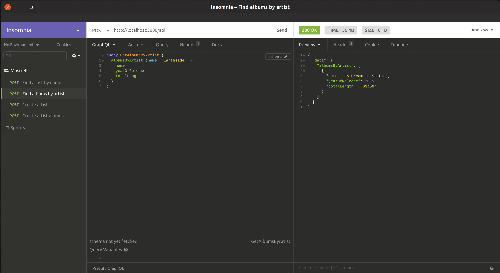

musikell
========

[](https://builtwithnix.org)

Example of a `GraphQL` application backed by `Neo4j` using [morpheus](https://morpheusgraphql.com/) and [hasbolt](https://hackage.haskell.org/package/hasbolt), respectively.


### Run it locally

##### Dependencies

We need a `Neo4j` instance running. Get it up and running quickly using `docker`.

```
docker run -it --rm -p7474:7474 -p7687:7687 --env NEO4J_AUTH=neo4j/test neo4j:latest
```

##### Using Cabal

```
cabal new-run musikell
```

##### Using Nix

Does not require to have `cabal` installed.

```
nix-shell --pure shell.nix
cabal new-run musikell
```

### GraphQL API via Http

Go to `http://localhost:3000/api` and start sending queries. Eg. using `Insomnia`:



You can also get the GraphQL Schema at `http://localhost:3000/schema.gql`.

### Queries

##### Get Artist

```
query GetArtist {
  artist (name: "Tool") {
    name
    spotifyId
  }
}
```

##### Get Albums by Artist

```
query GetAlbumsByArtist {
  albumsByArtist (name: "Opeth") {
    name
    yearOfReleased
    totalLength
  }
}
```

### Mutations

##### Create Artist

```
mutation CreateArtist {
  newArtist(names: ["Porcupine Tree", "Puscifer"]) {
    name
    spotifyId
  }
}
```

##### Create Artist Albums

```
mutation CreateArtistAlbums {
  newArtistAlbums(spotifyId: "0ybFZ2Ab08V8hueghSXm6E") {
    name
    yearOfRelease
    totalLength
  }
}
```
